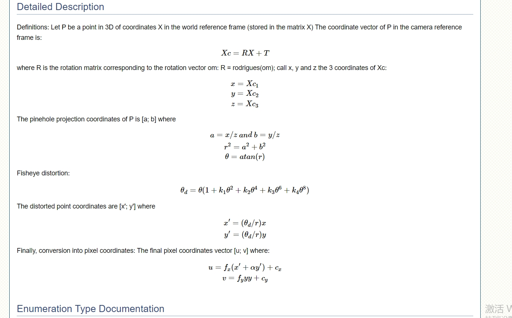

# 关于鱼眼

## 鱼眼畸变原理



## 鱼眼图片转正常图片脚本

```python {19-21}
import cv2
import numpy as np
import os

image_path = r'./input'
dest_path = r'./output'
fisheye_params = {
    'K': np.array([[475.38803410575747, 0., 977.4984204363925], [0., 475.57272709506276, 475.57272709506276], [0., 0., 1.]]), # 内部参数矩阵
    'D': np.zeros(4),                   # 畸变系数
    #'D': np.array([[-0.05727],[0.03123],[-0.07873],[0.057]]),
}
for item in os.listdir(image_path):
    dest_item_path = os.path.join(dest_path, item)
    os.makedirs(dest_item_path, exist_ok=True)
    if item.startswith('image') and len(item) < 10:
        new_path = os.path.join(image_path, item)
        for i in os.listdir(new_path):
            imgName = i
            image = cv2.imread(os.path.join(new_path, i))
            fisheye = cv2.fisheye.initUndistortRectifyMap(fisheye_params['K'], fisheye_params['D'], None, fisheye_params['K'], (image.shape[1], image.shape[0]), cv2.CV_16SC2)
            undistorted_img = cv2.remap(image, fisheye[0], fisheye[1], interpolation=cv2.INTER_LINEAR)
            cv2.imwrite(os.path.join(dest_item_path, str(imgName.split('.')[0])) + '.jpeg', undistorted_img)
```

::: tip
openCV 也可以在浏览器中使用
:::

## 鱼眼畸变在 three.js 中的应用

```js {7,36}
const distortion = (
  pt: THREE.Vector3,
  distortion: Record<string, number>,
  cameraInternal: Record<"cx" | "cy" | "fx" | "fy", number>
) => {
  const { k1, k2, k3, k4 } = distortion;
  const scaleMatrix = new THREE.Matrix4().makeScale(1, -1, -1);
  pt.applyMatrix4(scaleMatrix);
  let pu = { x: pt.x / pt.z, y: pt.y / pt.z };

  if (k1 == 0 && k2 == 0 && k3 == 0 && k4 == 0) return pt;

  let r = Math.sqrt(Math.pow(pu.x, 2) + Math.pow(pu.y, 2));
  let theta = Math.atan(r);
  let coeff =
    theta *
    (1 +
      k1 * Math.pow(theta, 2) +
      k2 * Math.pow(theta, 4) +
      k3 * Math.pow(theta, 6) +
      k4 * Math.pow(theta, 8));
  let pd = new THREE.Vector2((coeff / r) * pu.x, (coeff / r) * pu.y);

  const { fx, fy, cx, cy } = cameraInternal;
  let u = fx * (pd.x + 0 * pd.y) + cx;
  let v = fy * pd.y + cy;
  pt.setX(u);
  pt.setY(v);

  return pt;
};

positionsFrontV3.forEach((v) => {
  v.applyMatrix4(this.camera.matrixWorldInverse);
  if (fish) {
    v.copy(this.distortion(v, distortion, cameraInternal));
  } else {
    v.applyMatrix4(this.camera.projectionMatrix);
    this.projectToImg(v);
  }
});
```

::: warning
pt.applyMatrix4(scaleMatrix), 是将 y 轴和 z 轴进行变相，如果在视图变换的过程中没有进行变轴，则不需要这一步。
:::
