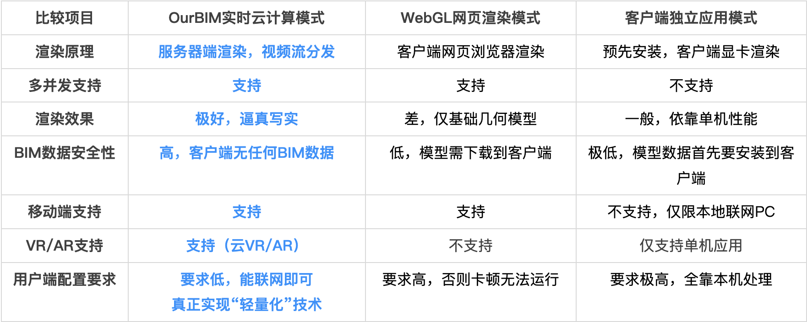
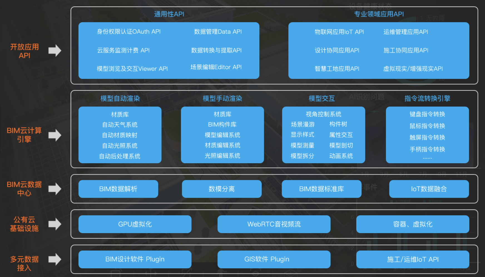
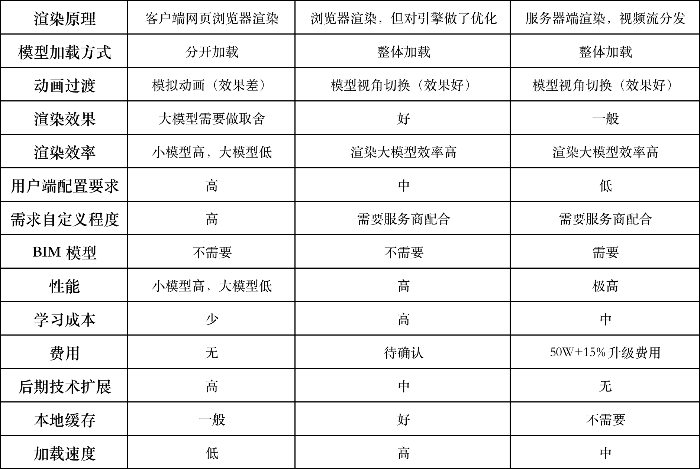

# 项目选型

## 建模选型

> 视频介绍：https://www.bilibili.com/video/BV1pe4y1k7JE/?is_story_h5=false&p=1&share_from=ugc&share_medium=android&share_plat=android&share_session_id=b47e229e-53d7-4c1d-9f87-b53002b5be89&share_source=WEIXIN&share_tag=s_i&timestamp=1663801154&unique_k=dinnZLv

- BIM 建模: 精度高，项目交付高标准，建模周期长（2-3个月）。

- 图纸建模: 项目交付标准一般，建模周期根据精度可控。

- 逆向建模: 倾斜摄影 + 激光点云，需后期修图。

## 渲染技术选型

- 云端渲染: 1.服务器端渲染 + webRTC + api接口；2.受制于服务商

- webGL 网页渲染: 1.模型分开建模，单个模型不能太大；2.性能问题自己控制

- 客户端渲染(引擎改良): 1.不用考虑性能问题；2.受制于服务商

## ourBIM 会议记录

### 参会人员

于浩、刘利、曹沙、唐勇、陈小鹃、牛经理

### 技术架构说明

### 优劣势分析

#### 优势

- 效率：实时云端渲染对客户端配置要求低。

- 时间：在医院能提供 BIM 模型的情况下，开发周期短。

#### 劣势

- 费用：私有云部署费用高(50w)，后期升级收取费用15%。

- 未来可能有部分自定义功能不能实现，受制于服务商。

### 会议结论

- 可以先尝试使用免费版做一个小 demo，作为备选方案。

- 在医院能提供 BIM 模型的情况下，开发周期短，2周左右。

## 整体结论（个人建议）

适当降低交付标准，建模根据图纸手动建模，采用 webGL 网页渲染。

- 有利于未来根据激光点云快速建模，快速交付以后的项目

- 技术沉淀，自己搭建云端渲染应用

- 具体实现：

    * 3栋建筑整体建模，只识别楼栋

    * 单栋建筑建模，识别楼层

    * 单层建筑，识别细节

## 方案对比

