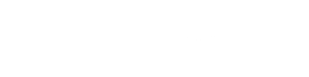

# 光墙特效

> 把光线图片作为贴图赋给材质，然后通过 offset，进行平移动画，实现光墙特效。



```js
import * as THREE from 'three'

const texture = new THREE.TextureLoader().load('./3D/texture/light-line.png')
// 设置阵列模式为 RepeatWrapping
texture.wrapS = THREE.RepeatWrapping
texture.wrapT = THREE.RepeatWrapping
texture.repeat.x = 5
texture.repeat.y = 5
const flowAnimation = () => {
  requestAnimationFrame(flowAnimation)
  // texture.offset.y -= 0.02;
  texture.offset.x -= 0.02
}
flowAnimation()

const LR = buildingModel.getObjectByName('左右')
if (LR) {
  LR.material = new THREE.MeshLambertMaterial({
    color: 0xffff00,
    transparent: true, //允许透明计算
    map: texture,
    opacity: 1,
    side: THREE.DoubleSide,
    depthTest: false
  })
}
```