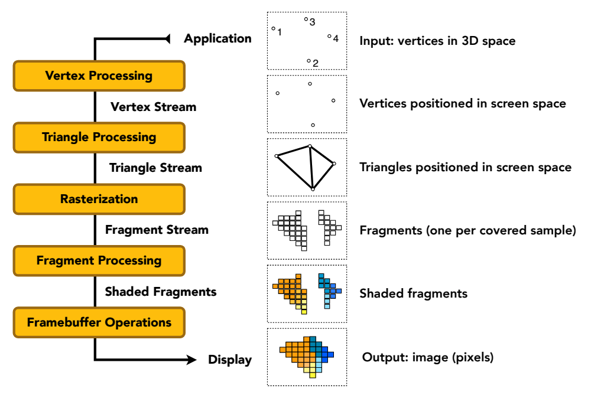

# 图形管线（Graphics Pipeline）

> 图形管线（Graphics Pipeline）是一系列的图形处理阶段，用于将输入的几何数据转换为最终的图像输出。它是图形渲染的核心流程，负责对图形对象进行处理、变换和渲染，以生成最终的可视化结果。

通常情况下，图形管线包括以下主要阶段：

1. 几何阶段（Geometry Stage）：该阶段负责处理输入的几何数据，例如顶点坐标、法线和纹理坐标等。在几何阶段中，可以进行顶点变换、投影变换、裁剪、三角形划分和顶点属性插值等操作。

2. 光栅化阶段（Rasterization Stage）：在光栅化阶段，将三维几何图形转化为二维的光栅图像。它将三角形片元化为像素，并确定每个像素的位置和相关属性，如颜色、深度和纹理坐标等。

3. 片元着色阶段（Pixel Shader Stage）：在片元着色阶段，为每个片元（像素）计算其最终的颜色值。这包括应用光照模型、纹理映射、阴影计算和透明度等。片元着色阶段是实现光照、纹理和其他视觉效果的关键环节。

4. 输出合成阶段（Output Merger Stage）：输出合成阶段将经过片元着色阶段的片元颜色和深度值合成为最终的图像输出。在此阶段，还可以进行混合（Blending）、深度测试（Depth Testing）和模板测试（Stencil Testing）等操作。
