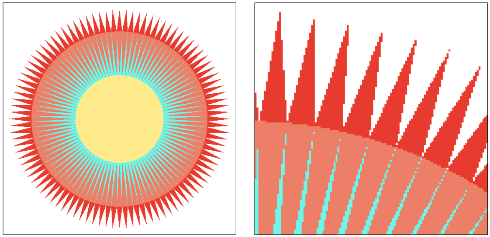
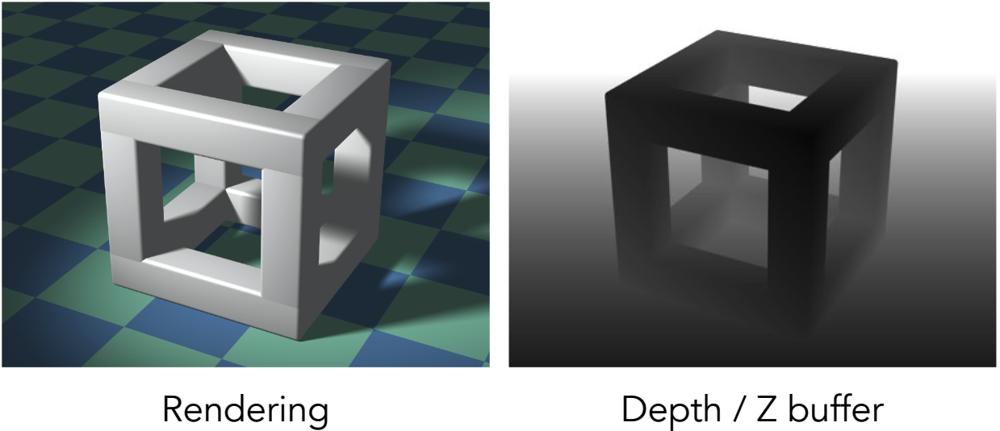

# 光栅化（Rasterization）

> 在计算机图形学中，光栅化是将连续的几何形状和属性转换为离散像素的过程。在光栅化的过程中，取样是其中的核心概念之一。

## 取样（Sampling）


```c++
for (int x = 0; x < xmax; ++x)
  for (int y = 0; y < ymax; ++y)
    image[x][y] = inside(tri, x + 0.5, y + 0.5); 
```

### inside 函数


向量叉乘右手螺旋定则：

- $$\vec {AB} $$ · $$\vec {AQ} $$ 方向为正，代表 Q 在 $$\vec {AB} $$ 的左侧
- $$\vec {BC} $$ · $$\vec {BQ} $$ 方向为正，代表 Q 在 $$\vec {BC} $$ 的左侧
- $$\vec {CA} $$ · $$\vec {CQ} $$ 方向为负，代表 Q 在 $$\vec {CA} $$ 的右侧

三个叉乘方向不同，所以 Q 在三角形 ABC 的外部

## 取样瑕疵（Sampling Artifacts）

- 锯齿：Jaggies – sampling in space

- 摩尔纹：Moire – undersampling images 

- 车轮效应：Wagon wheel effect – sampling in time

### 抗锯齿（Antialias）




#### 锯齿产生的原因

> 个人理解：把图像看成信号，图像信号频率变化太快，但是光栅化采样太慢，形成了空缺，图像不连续，形成了锯齿。

> 一个词解释：undersampling：采样过疏

#### 抗锯齿的方法

> 光栅化采样之前，先对图像边缘进行模糊处理。


#### 抗锯齿原理解析

- 傅里叶变换


- 卷积理论


#### 实际开发中的抗锯齿

- webGL

```js
const context = canvas.getContext('webgl', { antialias: true });
```

- THREE.js

```js
const renderer = new THREE.WebGLRenderer({ antialias: true });

// or

const renderer = new THREE.WebGLRenderer();
renderer.domElement.style.imageRendering = 'auto';
renderer.domElement.style.imageRendering = 'crisp-edges';
renderer.domElement.style.imageRendering = 'pixelated';
```

#### 抗锯齿方法汇总

- 多重采样抗锯齿（Multisample Anti-Aliasing，MSAA）：MSAA 是一种硬件加速的抗锯齿技术。它使用多个采样点来对图像进行抗锯齿处理，每个采样点记录一些像素的颜色和深度信息。通过对这些采样点进行插值，可以减少锯齿状边缘的出现。MSAA 是一种高质量的抗锯齿方法，但它会增加计算开销和内存消耗。

- 快速近似抗锯齿（Fast Approximate Anti-Aliasing，FXAA）：FXAA 是一种基于后处理的抗锯齿技术，它通过对整个图像进行分析和处理来减少锯齿状边缘。FXAA 使用了一些启发式算法和模糊技术，通过对锯齿边缘进行模糊处理来实现抗锯齿效果。FXAA 的优点是速度快，但可能会导致一些图像细节的损失。

- 时域抗锯齿（Temporal Anti-Aliasing，TAA）：TAA 是一种基于时间上的抗锯齿技术，它结合了帧之间的信息来减少锯齿状边缘。TAA 利用了连续帧之间的运动和像素颜色变化的关系，通过对多个帧进行混合和插值来消除锯齿。TAA 可以提供高质量的抗锯齿效果，并且对运动和细节保持较好的处理能力，但它可能会引入一些运动模糊或图像伪影。

## 深度测试（Z-buffer）

### 画家算法

> 基于图形的算法：先画远处的图形，再画近处的图形。

> 三个三角形相互遮挡的情形，无法处理。


### Z-buffer

#### Z-buffer 算法过程

1. 在渲染场景之前，创建一个与屏幕分辨率相同的深度缓冲区（Z-Buffer），用于存储每个像素的深度值。

2. 对于每个要渲染的物体，按照其离相机的距离进行排序。通常使用物体的中心点距离相机的距离作为参考。

3. 对于每个物体，按照其面片（三角形）的顺序进行渲染。对于每个面片，通过逐像素扫描的方式进行渲染。

4. 对于每个像素，计算它在相机空间中的深度值。

5. 检查深度缓冲区中该像素的深度值，与当前计算得到的深度值进行比较。

  - 如果当前深度值小于深度缓冲区中的值，表示该像素在当前面片前方，更新深度缓冲区的值，并使用当前面片的颜色值来更新屏幕上的像素颜色。

  - 如果当前深度值大于或等于深度缓冲区中的值，表示该像素在其他面片前方或处于遮挡状态，不更新深度缓冲区和像素颜色，保留深度缓冲区中的值和之前的颜色。

6. 重复步骤 4 和步骤 5，直到渲染完所有的物体和面片。

#### Z-buffer 算法伪代码


#### Z-buffer 例子



## 透明物体的深度问题(实际项目中碰到过)

> 在计算机图形学中，处理透明物体的深度排序和渲染是一个复杂的问题。传统的深度缓冲（Z-buffer）算法在处理透明物体时存在一些挑战，因为它们假设物体的渲染顺序是固定的，无法正确处理透明物体的交叠和混合效果。

> 以下是一些常见的方法用于解决透明物体深度排序的问题：

* 前向渲染（Forward Rendering）：在前向渲染中，透明物体按照离相机的距离进行排序，并按照顺序渲染到屏幕上。这样可以确保前面的透明物体覆盖后面的物体。然而，前向渲染需要对每个透明物体进行排序，增加了渲染的复杂性和计算开销。

* 深度排序算法（Depth Sorting Algorithms）：深度排序算法用于对透明物体进行排序，以便按正确的顺序渲染它们。常见的深度排序算法包括离相机距离排序、图元重排序（如 BSP 树、八叉树等）、Alpha 混合排序等。这些算法可以根据透明物体之间的相互遮挡关系和混合模式进行排序。

* 延迟混合（Deferred Blending）：延迟混合是一种用于处理透明物体的深度问题的技术。它通过将透明物体的颜色和深度信息存储在附加的缓冲区中，并在最后阶段进行混合操作。这样可以解决透明物体的深度排序问题，并且可以在片段着色器中使用透明度（Alpha）值进行混合计算。

* 顺序无关透明度（Order-Independent Transparency，OIT）：OIT 是一种使用多种技术来处理透明物体的深度问题的方法。它包括基于排序的方法、多层深度缓冲（如 Dual Depth Peeling）和基于像素的排序等。OIT 技术可以实现更高质量的透明效果，但通常需要更多的计算和内存开销。
