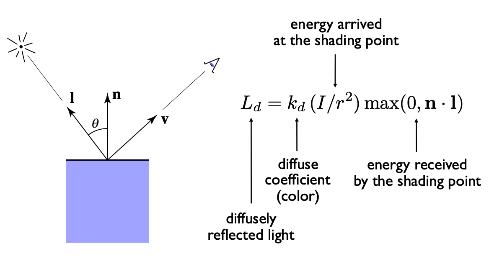
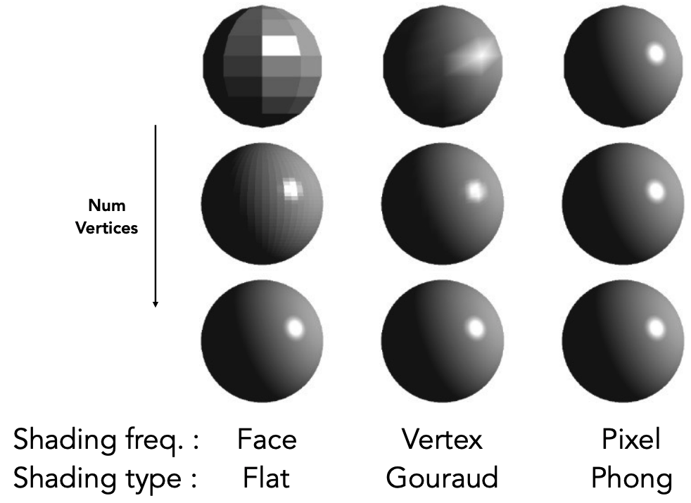
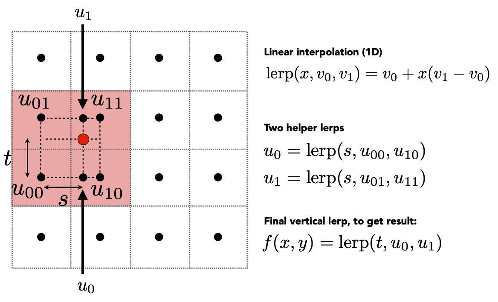
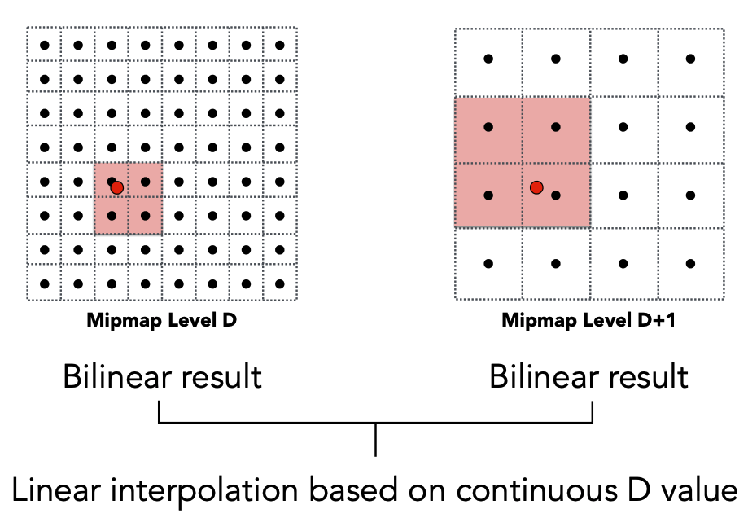

# 着色（Shading）

## 光照模型计算

> 在光照模型计算中，可以考虑光源的类型（如点光源、方向光源、环境光等）以及材质属性（如漫反射、镜面反射、环境反射等）。根据像素的位置、法线方向和光照参数，计算像素的漫反射和镜面反射颜色，以模拟光照效果。

### Blinn-Phong 模型

> Blinn-Phong 模型包含三部分：漫反射（Diffuse reflection） + 镜面反射（Specular highlights） + 环境光反射（Ambient lighting）


#### 漫反射（Diffuse reflection）



$$L_d = k_d \cdot (I/r^2) \cdot \max(0, \mathbf{n} \cdot \mathbf{l})$$

#### 镜面反射（Specular highlights）

* Phong 模型中的 v 和 R


* 半程向量


$$L_s = k_s \cdot (I/r^2) \cdot (\max(0, \mathbf{n} \cdot \mathbf{h}))^p$$


#### 环境光反射（Ambient lighting）

$$L_a = k_a \cdot I_a$$

其中，$$k_a$$ 是环境光系数，$$I_a$$ 是环境光照强度。

#### Blinn-Phong 模型公式


$$L = L_a + L_d + L_s = k_a \cdot I_a + k_d \cdot (I/r^2) \cdot (\mathbf{n} \cdot \mathbf{l}) + k_s \cdot (I/r^2) \cdot (\max(0, \mathbf{n} \cdot \mathbf{h}))^p$$

### 着色频率

> 着色频率有三种：每个三角面着色、每个顶点着色、每个像素着色。

> 上面的 Blinn-Phong 模型针对的是物体表面一个单一的点，模型中的法向量很重要，不同的着色频率法向量的计算难度也不同：

  * 三角面的法向量：$$\vec {AB} \cdot \vec {AC}$$

  * 顶点的法向量：与该顶点相连的多个三角面法向量加权平均

  * 像素的法向量：通过对几何体的法向量进行插值，重⼼坐标插值（Barycentric Interpolation）



### 重⼼坐标（Barycentric Coordinates）

- 重心坐标必须满足两个条件：

  * 重心坐标的值为非负数：u ≥ 0，v ≥ 0，w ≥ 0。

  * 重心坐标的值之和为 1：u + v + w = 1。

- 插值的时候，u v w 都取 1/3


- 插值效果


#### 重⼼坐标的应用

* 颜色插值和混合：如果像素的颜色是通过顶点着色插值得到的，片元着色阶段可以对这些颜色进行插值操作，以得到像素的最终颜色。此外，还可以进行颜色的混合操作，如透明度混合、颜色混合和阴影混合等。

* 法线插值和变换：对于法线映射和光照计算，片元着色阶段可以进行法线向量的插值操作，以在像素级别上模拟物体表面的细节。此外，还可以对法线进行变换，以适应不同的坐标系或局部坐标空间。

## 纹理映射

> 如果应用了纹理映射，片元着色阶段将进行纹理坐标的插值和采样操作。根据纹理坐标，在纹理图像中查找对应的颜色值，并将其应用到像素上。这允许在表面上显示出纹理、图案或图像。

> 纹理映射的问题：纹理太小，锯齿；纹理太大，摩尔纹、锯齿、过度模糊；

### 纹理太小问题

> Texture Magnification：texture is too small

* 效果图


* Nearest 插值：就近取值

* Bilinear 插值：就近4个点双线性插值

  

* Bicubic 插值：就近16个点插值

### 纹理太大问题

> Texture Magnification：texture is too large

* 效果图


* 问题分析：本质就是采样问题，超采样可以解决问题，但是开销太大，更好的解决方案是：直接不采样，将采样的点查询换成范围查询。

* Mipmaps：正方形范围查询

  - Mipmaps 图

  

  - Mipmaps 层级计算

  

  - Mipmaps 层级就近取整效果图

  

  - Mipmaps 不同层级之间的 Trilinear 插值计算过程

  

  - Mipmaps 层级 Trilinear 插值效果图

  

* Ripmaps：矩形范围查询

> Anisotropic Filtering: 各向异性过滤


* EWA：不规则图形范围查询

> EWA Filtering: 椭圆加权平均过滤


## 后期处理和特效

> 片元着色阶段还可以应用各种后期处理技术和特效，如景深效果、运动模糊、辉光、色彩校正等。这些技术可以在最后的渲染阶段对像素进行进一步的处理，以增强图像的质量和艺术效果

### THREE.JS 的后期处理代码示例

```js
import * as THREE from 'three'
// 导入后期效果合成器
import { EffectComposer } from 'three/examples/jsm/postprocessing/EffectComposer'

// three框架本身自带效果
import { RenderPass } from 'three/examples/jsm/postprocessing/RenderPass'
import { GlitchPass } from 'three/examples/jsm/postprocessing/GlitchPass'

// 合成效果
const effectComposer = new EffectComposer(renderer)
effectComposer.setSize(window.innerWidth, window.innerHeight)

// 添加渲染通道
const renderPass = new RenderPass(scene, camera)
effectComposer.addPass(renderPass)

// 屏幕闪动
const glitchPass = new GlitchPass()
effectComposer.addPass(glitchPass)

const clock = new THREE.Clock()
function animate() {
  const elapsedTime = clock.getElapsedTime()
  rawShaderMaterial.uniforms.uTime.value = elapsedTime
  animationID = requestAnimationFrame(animate)
  renderer && renderer.render(scene, camera)
  effectComposer.render()
}

animate()
```
